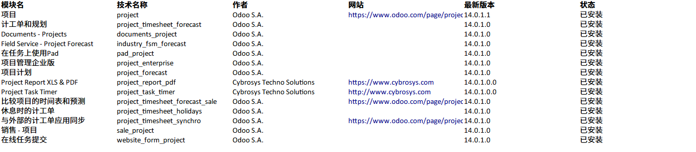
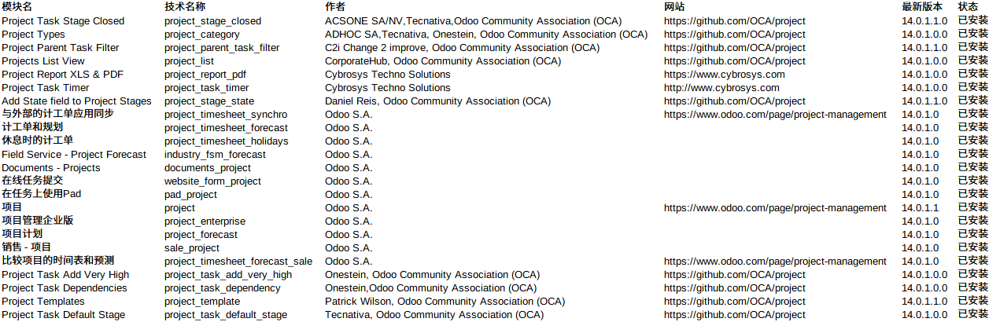

# 说明

## 项目管理模块

设计Project模块的有14个：

还需要开发：

document_page_project

还有下面好项目：

[https://github.com/OCA/project-agile](https://github.com/OCA/project-agile)

[https://github.com/OCA/project](https://github.com/OCA/project) 项目地址我们Fork到[https://github.com/odoochain/addons_oca_project](https://github.com/odoochain/addons_oca_project)

增加9个OCA开源总数达到23个

到这里就可以了么，还不行，从[https://github.com/odoochain/addons_oca_project/tree/13.0](https://github.com/odoochain/addons_oca_project/tree/13.0) 我们看到还有26-9=17个项目尚未从odoo13版本升级到odoo14

从 [oca](https://github.com/OCA/project/issues/721) 讨论中可以看到大家都在紧锣密鼓。

